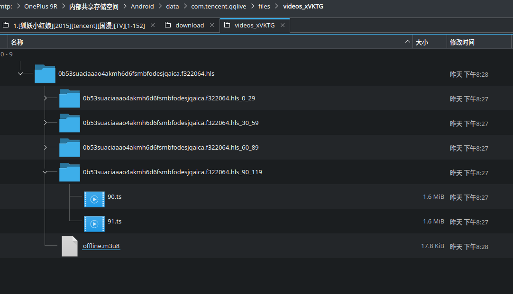

# [视频缓存](../README.md)

## 腾讯视频

### 前提条件

- 已安装FFmpeg
- 腾讯视频已将所需的视频缓存好并整理到一个文件夹内
> 腾讯视频缓存目录：`/Android/data/com.tencent.qqlive/files/videos_xVKTG/`




### 1. 将腾讯视频缓存的问题放置到一个目录，目录名称为数字
```
songhu@magicbook:~/tmp/huyaoxiaohongniang> ls -R
.:
152  run.sh

./152:
0.ts   13.ts  17.ts  20.ts  24.ts  28.ts  31.ts  35.ts  39.ts  42.ts  46.ts  4.ts   53.ts  57.ts  60.ts  64.ts  68.ts  71.ts  75.ts  79.ts  82.ts  86.ts  8.ts   filelist.txt
10.ts  14.ts  18.ts  21.ts  25.ts  29.ts  32.ts  36.ts  3.ts   43.ts  47.ts  50.ts  54.ts  58.ts  61.ts  65.ts  69.ts  72.ts  76.ts  7.ts   83.ts  87.ts  90.ts
11.ts  15.ts  19.ts  22.ts  26.ts  2.ts   33.ts  37.ts  40.ts  44.ts  48.ts  51.ts  55.ts  59.ts  62.ts  66.ts  6.ts   73.ts  77.ts  80.ts  84.ts  88.ts  91.ts
12.ts  16.ts  1.ts   23.ts  27.ts  30.ts  34.ts  38.ts  41.ts  45.ts  49.ts  52.ts  56.ts  5.ts   63.ts  67.ts  70.ts  74.ts  78.ts  81.ts  85.ts  89.ts  9.ts

```

### 2. 执行`ffmpeg_convert_videos.sh`脚本
```
## 若没有可执行权限，添加可执行权限
chmod +x ffmpeg_convert_videos.sh
./ffmpeg_convert_videos.sh | bash
```
### 3. 重命名
```
find . -name out.mp4 | while read line; do echo "mv $line `echo $line | sed -r 's#.*/([0-9]+)/.*#\1.[狐妖小红娘][2015][tencent][国漫][TV].mp4#g'`"; done | bash
```